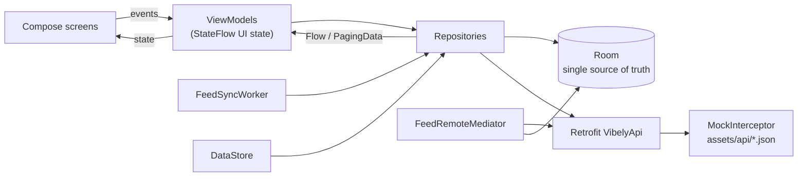
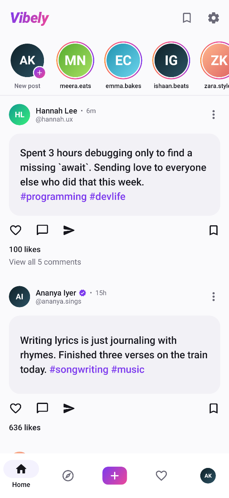
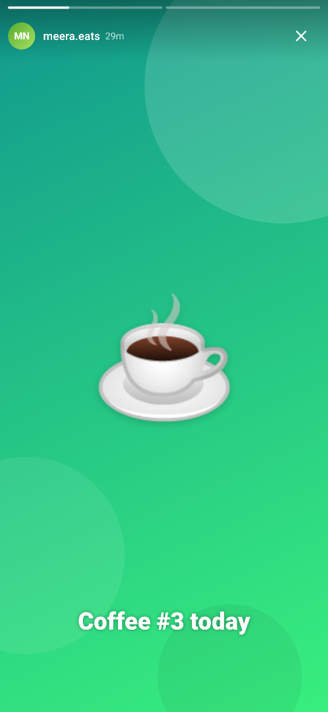
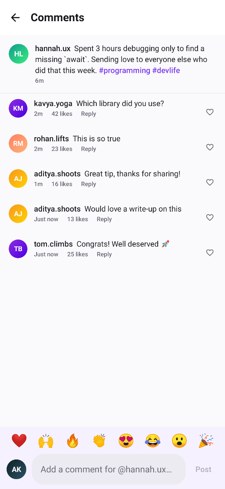
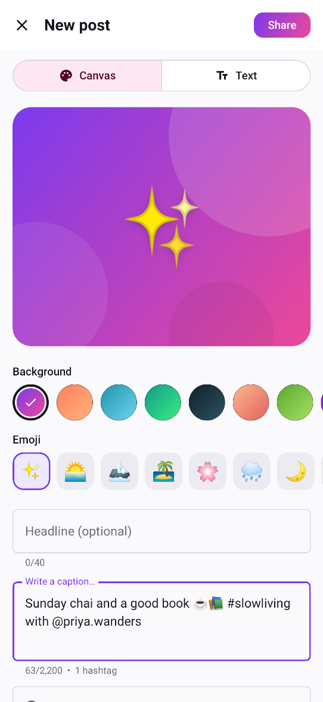
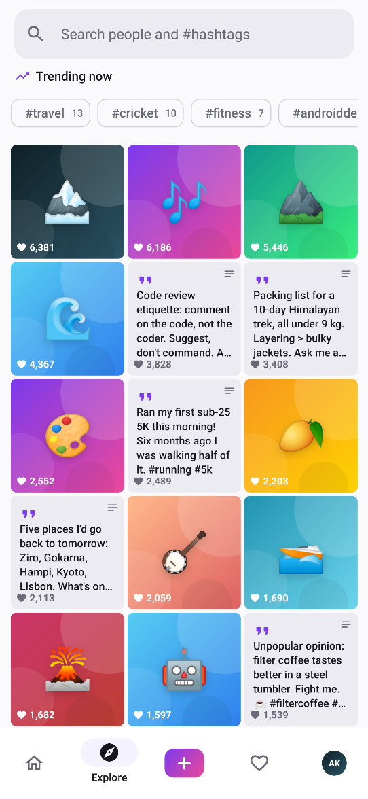
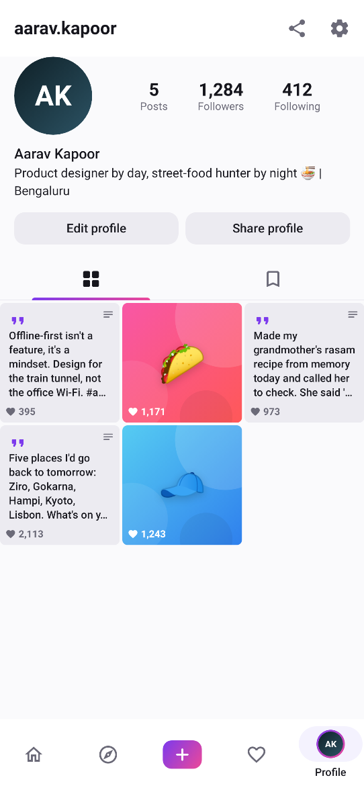
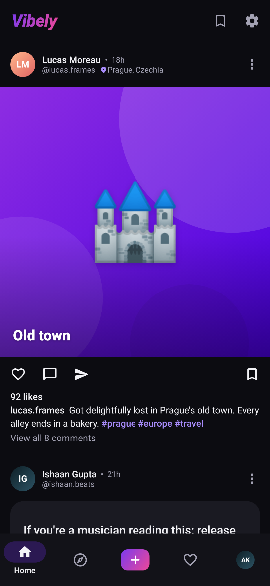
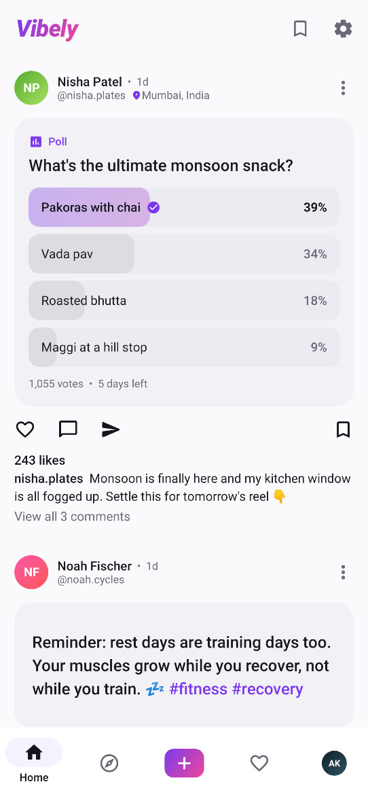
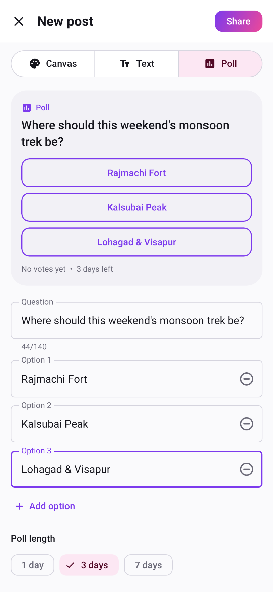

# Vibely

**Share the moments that matter.** Vibely is an offline-first social app for Android: a paged home feed with stories, polls, likes, comments, saves and follows, built with Jetpack Compose and a modern MVVM architecture.

[](https://github.com/iEswar23/Vibely/actions/workflows/android-ci.yml)


Every post is a "canvas" (a gradient background, a big emoji and a headline) or a text-only post. All of it is drawn in Compose, so the app looks complete without loading a single network image. A mock REST backend runs inside the app, which means everything works offline straight after cloning.

## Features

- **Home feed**: an infinite feed built on Paging 3 with a Room `PagingSource` and a `RemoteMediator`. Includes a stories row, author headers (initials avatar, name, handle, time ago, location), pull-to-refresh, shimmer skeletons, an append footer with retry and an "all caught up" end state.
- **Interactions**: double-tap to like with a heart-burst animation, plus like, comment, share (Android share sheet) and save. Likes, saves and follows are optimistic. They're written to Room straight away and rolled back if the API call fails. Unsaving a post shows a snackbar with **Undo**.
- **Rich captions**: `#hashtags` and `@mentions` are parsed, styled in the brand colour and clickable (`AnnotatedString` + `LinkAnnotation`). They open the hashtag page or the person's profile.
- **Stories**: a full-screen viewer with segmented progress bars that advance on their own. Tap left or right to move, press and hold to pause, swipe down to close. Viewed stories get a grey ring and move to the end of the row.
- **Comments**: the caption header, a comment list with likes and "Reply", quick emoji reactions and an input that sits above the keyboard.
- **Create post**: pick a Canvas, Text or Poll post, a gradient, an emoji, an optional headline, a caption and a location, with a live preview. Validation covers caption length, a hashtag limit and headline/location length. Publishing goes through the API and puts the post at the top of the feed.
- **Polls**: ask a question with 2–4 options (add or remove them as you go) that runs for 1, 3 or 7 days. The composer checks for a question, blank or duplicate options and length limits, and previews the poll live. In the feed you tap an option to vote; after voting, or once the poll closes, the options turn into animated percentage bars with your pick ticked, the total vote count and "5 days left" or "Final results". Votes are optimistic like likes (written to Room first, rolled back if the API call fails) and limited to one per user. The maths lives in a pure `PollTally`: largest-remainder percentages that always add up to 100, zero-vote polls and expiry through an injected `Clock`.
- **Explore**: trending hashtag chips, a popular-posts grid (`LazyVerticalGrid`) and debounced search across people and hashtags.
- **Profiles**: your own profile and other people's, with post/follower/following counts (animated), bio, website, follow and unfollow, edit profile (validated, with a unique-username check), and Posts / Saved tabs.
- **Activity**: likes, comments, follows and mentions grouped into *Today*, *This week* and *Earlier* with sticky headers. Unread items are highlighted and the bottom-nav badge clears once you've seen them. Also has "Follow back" and "Suggested for you".
- **Settings**: System / Light / Dark theme and a private-account toggle, both saved in DataStore, plus a logout-style reset that wipes local data and downloads the starter content again.
- **Background sync**: a `FeedSyncWorker` (`@HiltWorker`) runs once at startup and then every 6 hours to keep users, stories, activity and the first feed page cached.
- **Polish**: splash screen, adaptive and themed launcher icon, edge-to-edge layout, violet-to-pink brand gradient and a dark mode tuned by hand.

## Tech stack

| Layer | Libraries |
| --- | --- |
| UI | Jetpack Compose, Material 3, Navigation Compose, Paging Compose, core-splashscreen |
| Presentation | MVVM, `ViewModel` + `StateFlow`, sealed UI states, one-off events via `Channel` |
| DI | Hilt (incl. `hilt-navigation-compose` and `hilt-work`) |
| Data | Room (+ room-paging), Paging 3 `RemoteMediator`, DataStore Preferences |
| Network | Retrofit, OkHttp, Gson. A custom `MockInterceptor` serves JSON fixtures from `assets/api` with 300–700 ms latency |
| Background | WorkManager (`CoroutineWorker`, periodic and one-time unique work) |
| Async | Kotlin Coroutines and Flow, with injected dispatchers |
| Testing | JUnit 4, Truth, kotlinx-coroutines-test, hand-written fakes, Robolectric + Roborazzi screenshot tests |

## Architecture

Room is the single source of truth. Screens observe Flows from repositories, and repositories refresh the cache from the (mock) API.



The home feed works like this: `Pager(remoteMediator = FeedRemoteMediator, pagingSourceFactory = postDao::feedPagingSource)`. The mediator fetches `GET /feed?page=n` (the posts plus side-loaded authors), and `FeedCacheWriter` writes them to Room in one transaction. The UI only pages through Room.

Optimistic updates follow one pattern everywhere: update Room → call the API → if the call fails, revert Room and return `Result.failure`. The ViewModel then shows a snackbar.

Schema changes ship as explicit Room `Migration`s. Version 2 adds polls as nullable `poll_*` columns on `posts` (an `@Embedded` `PollEntity`), so cached likes, saves and your own posts survive the upgrade. A destructive fallback stays in place for any missing path, because everything can be downloaded again.

## Package structure

```
io.github.ieswar23.vibely
├── data
│   ├── local          # Room database, entities, DAOs, entity → domain mappers
│   ├── paging         # FeedRemoteMediator, FeedCacheWriter
│   ├── remote         # VibelyApi, DTOs, DTO → entity mappers
│   │   └── mock       # MockInterceptor + asset source
│   ├── repository     # Post/User/Story/Comment/Activity/Settings/Sync repositories
│   └── sync           # FeedSyncWorker (WorkManager)
├── di                 # Hilt modules (database, network, repositories, app)
├── domain
│   ├── model          # Post, Poll, User, Story, Comment, ActivityItem, PostDraft, ...
│   ├── PollTally.kt   # Poll percentages, expiry and one-vote rules
│   └── PostDraftValidator.kt
├── ui
│   ├── activity       # Activity / notifications
│   ├── comments       # Comments screen
│   ├── common         # PostCard, PollCard, PostCanvas, avatars, rich text, shimmer, buttons
│   ├── create         # Create post
│   ├── explore        # Explore, search, hashtag page
│   ├── feed           # Home feed + stories row
│   ├── navigation     # Routes, NavHost, navigator
│   ├── post           # Post detail
│   ├── profile        # Profile + edit profile
│   ├── settings       # Settings
│   ├── story          # Story viewer
│   └── theme          # Colours, gradients, typography, theme
├── util               # TimeAgo, TextTokenParser, CountFormatter, Clock
├── MainActivity.kt
└── VibelyApplication.kt
```

## Getting started

1. Install **Android Studio Ladybug (2024.2.1) or newer** with **JDK 17**.
2. Clone the repository and open the project folder in Android Studio.
3. Let Gradle sync, then run the `app` configuration on an emulator or device (API 24+).

From the command line:

```bash
./gradlew assembleDebug
```

You don't need API keys, Firebase or a network connection. The seed data (25 users, 122 posts including two polls, about 540 comments, stories and activity) ships in `app/src/main/assets/api`.

## Testing

```bash
./gradlew testDebugUnitTest
```

The unit tests cover:

- `TimeAgoTest`: compact and long relative times, date fallbacks and Today / This week buckets
- `TextTokenParserTest`: hashtag and mention parsing edge cases (emails, trailing dots, numeric tags)
- `CountFormatterTest`: 4,210 / 48.2K / 1.2M formatting
- `PollTallyTest`: largest-remainder percentages that always sum to 100, ties, zero votes, one vote per user, expiry and "x days left" labels with an injected clock
- `FeedViewModelTest`: like/unlike, double-tap semantics, rollback on failure, bookmark undo, optimistic poll votes with rollback, and the one-vote rule
- `ProfileViewModelTest`: follow/unfollow counts, failure rollback, "me" and "@mention" resolution
- `CreatePostViewModelTest` and `PostDraftValidatorTest`: publish validation rules and draft mapping, including poll questions, blank, duplicate and too-long options, and adding or removing options
- `PostRepositoryPollTest` (Robolectric): the real repository against in-memory Room and the mock API. The vote is in Room before the API answers, a failed call rolls it back, and a second vote never reaches the API
- `DatabaseMigrationTest` (Robolectric): upgrades a real version 1 database file and lets Room validate the migrated schema
- `PollMappersTest`: poll DTO → entity → domain mapping and fallbacks for malformed polls
- `MockInterceptorTest`: feed pagination, relative (past and future) timestamp rendering, echoing created posts and polls

### Screenshot tests

`ScreenshotTest` uses Robolectric (native graphics) and [Roborazzi](https://github.com/takahirom/roborazzi) to launch the real `MainActivity` on the JVM, with the full Hilt graph, Room, Paging and the mock API. It waits for data to load, clicks through to each screen and captures it. You don't need an emulator. To regenerate the images in `docs/screenshots/`, run:

```bash
./gradlew recordRoborazziDebug
```

A plain `./gradlew testDebugUnitTest` still runs these flows as smoke tests, but it doesn't write or compare any images.

## Screenshots

<table>
  <tr>
    <td align="center"><br/><sub>Home feed with stories</sub></td>
    <td align="center"><br/><sub>Story viewer</sub></td>
    <td align="center"><br/><sub>Comments with quick reactions</sub></td>
  </tr>
  <tr>
    <td align="center"><br/><sub>Create a canvas post</sub></td>
    <td align="center"><br/><sub>Explore: trending tags and grid</sub></td>
    <td align="center"><br/><sub>Profile</sub></td>
  </tr>
  <tr>
    <td align="center"><br/><sub>Feed in dark theme</sub></td>
    <td align="center"><br/><sub>Poll results after voting</sub></td>
    <td align="center"><br/><sub>Create a poll</sub></td>
  </tr>
</table>

## Roadmap

- Let people post their own stories from the Create screen (the viewer and data model already handle multi-frame stories).
- Threaded comment replies with "View replies" expansion.
- Direct messages with an offline outbox synced through WorkManager.
- Compose UI interaction tests for the like, comment and publish flows.

## Author

**Eswar Reddy Madhira** — Android Developer

[](https://www.linkedin.com/in/eswar-reddy-android)
[](https://github.com/iEswar23)
